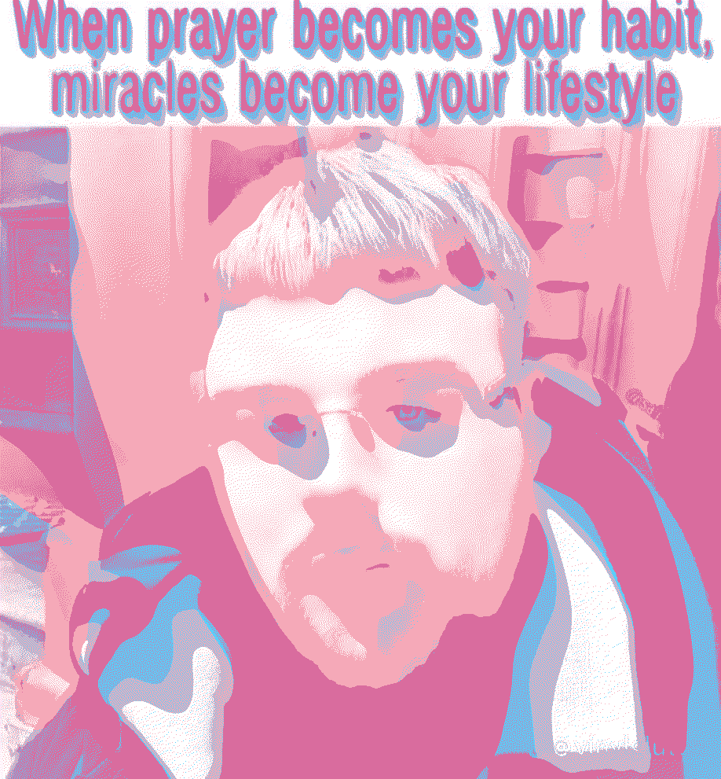
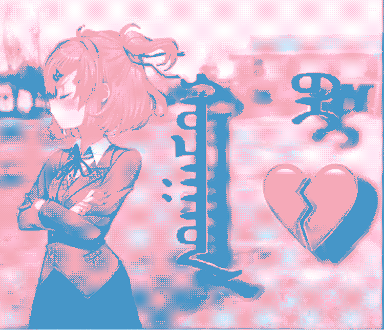

# trans-writes

**trans-writes** (lossy) transforms images and writes them to your disk. 

An interactive image transformation tool that converts any image to use an expanded transgender flag palette with perceptually uniform color matching. It even renames the files for you!

<p align="center">
  
</p>

More examples of before-after, varying dithering and file format:

<p align="center">
  
  
</p>

<p align="center">
  
  
</p>

### Features

  - LAB color space (via scikit-image) for color matching that matches human perception
  - Fallback to weighted RGB distance if scikit-image is not installed
  - Dithering (Floyd-Steinberg, Atkinson, Ordered (Bayer))
  - Numba JIT compilation for 10-50x faster dithering (optional if you want to wait 20 years for any image larger than 1mb)
  - Create mosaic effects with block sizes 1-32
  - See changes instantly
  - Compare the file sizes by viewing original size, compressed size, and savings
  - **Multiple Export Formats**:
  - PNG (optimized compression)
  - BMP (uncompressed)
  - WebP (lossless)
  - JPEG XL (lossless, if supported)
  - please lock in and help defeat the monopoly of Google trying to kill jpegxl

### Requirements

- Python 3.8+
- Pillow (PIL)
- numpy
- pillow-jxl-plugin (for JPEG XL support)
- scikit-image (recommended for better color matching)
- numba (recommended for faster processing)

### Expanded Palette Colors

| Color Name          | Hex Code | RGB              |
|---------------------|----------|------------------|
| Light Blue          | #5bcefa  | (91, 206, 250)   |
| Medium Blue         | #96dcfa  | (150, 220, 250)  |
| Very Light Blue     | #c8ebff  | (200, 235, 255)  |
| White               | #ffffff  | (255, 255, 255)  |
| Very Light Pink     | #ffdcf0  | (255, 220, 240)  |
| Light Pink          | #f5a9b8  | (245, 169, 184)  |
| Darker Pink         | #d96c9e  | (217, 108, 158)  |

### Color Matching Methods

#### LAB Color Space (Recommended)
When scikit-image is installed, the app uses LAB color space for matching. LAB distance closely matches human perception, producing more natural color mapping.

#### Weighted RGB Fallback
Without scikit-image, the app uses weighted RGB distance (green weighted more heavily) to approximate perceptual uniformity.

### Dithering Algorithms

#### Floyd-Steinberg
Classic error diffusion for smooth gradients:
```
        *   7/16
  3/16  5/16  1/16
```

#### Atkinson
Sharper look with less error distribution:
```
        *   1/8  1/8
  1/8  1/8  1/8
        1/8
```

#### Ordered (Bayer 4×4)
Crosshatch pattern using threshold matrix.

Proudly made using AI.
