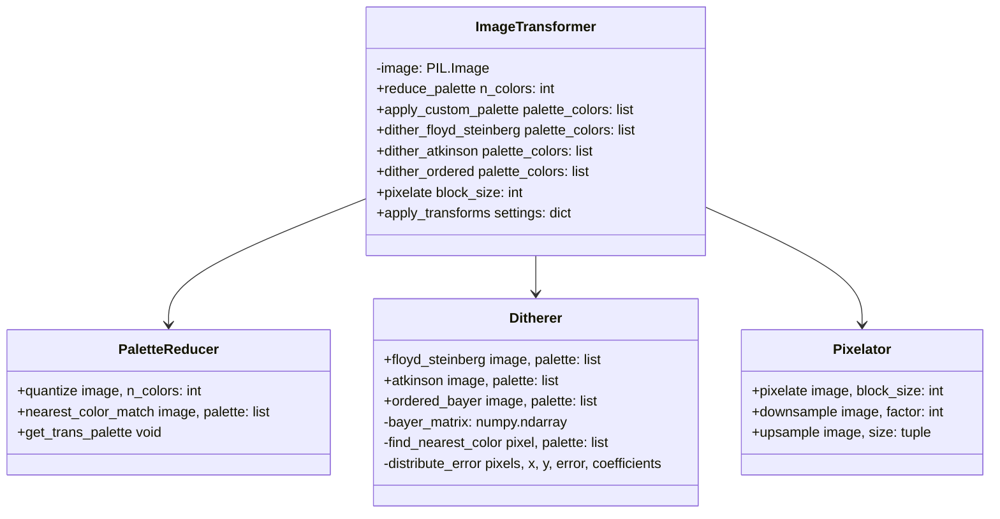
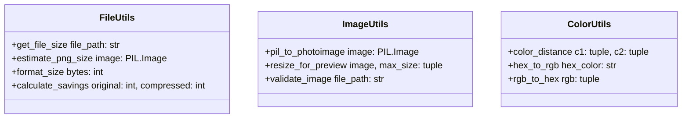
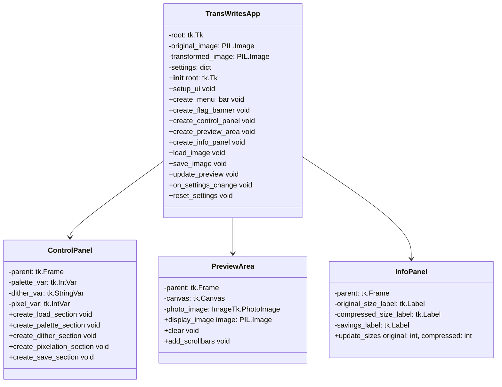
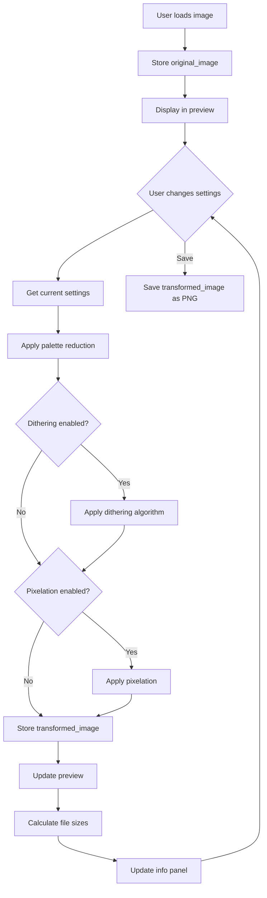

# trans-writes Architecture Plan

## Project Overview

**trans-writes** is an interactive image transformation tool that applies lossy compression techniques to create stylized pixel art. The application features a transgender flag color theme as a visual tribute.

## Color Theme

| Color Name   | Hex Code  | Usage                           |
|--------------|-----------|---------------------------------|
| Light Blue   | #5bcefa   | Background, headers             |
| Light Pink   | #f5a9b8   | Buttons, accents, sliders       |
| White        | #ffffff   | Text, backgrounds, borders      |
| Dark Pink    | #d96c9e   | Contrast color for trans palette|

## Project Structure

```
trans-writes/
├── main.py           # Entry point, launches the application
├── gui.py            # Main GUI class and all UI components
├── transforms.py     # Image transformation algorithms
├── utils.py          # Helper functions
├── README.md         # Documentation
└── plans/            # Planning documents
    └── trans-writes-architecture.md
```

## Module Architecture

### 1. transforms.py - Image Transformation Module



#### Key Functions

| Function | Description | Parameters |
|----------|-------------|------------|
| `reduce_palette_pillow` | Reduce colors using Pillow quantize | image, n_colors |
| `apply_custom_palette` | Apply fixed color palette | image, palette_colors |
| `dither_floyd_steinberg` | Floyd-Steinberg error diffusion | image, palette_colors |
| `dither_atkinson` | Atkinson error diffusion | image, palette_colors |
| `dither_ordered` | Bayer 4x4 ordered dithering | image, palette_colors |
| `pixelate` | Block-based pixelation | image, block_size |

### 2. utils.py - Utility Module



#### Key Functions

| Function | Description | Returns |
|----------|-------------|---------|
| `estimate_png_size` | Calculate PNG size using BytesIO | int (bytes) |
| `format_file_size` | Format bytes as KB/MB string | str |
| `pil_to_photoimage` | Convert PIL Image to tkinter PhotoImage | ImageTk.PhotoImage |
| `calculate_savings_percentage` | Calculate compression ratio | float |
| `hex_to_rgb` | Convert hex color to RGB tuple | tuple |

### 3. gui.py - GUI Module



#### GUI Layout Structure

```
┌─────────────────────────────────────────────────────────────┐
│  █████████████████████████████████████████████████████████  │ <- Flag banner
│  █████████████████████████████████████████████████████████  │    (blue/pink/white stripes)
├─────────────────────────────────────────────────────────────┤
│                    trans-writes                             │ <- Title
├──────────────────┬──────────────────────────────────────────┤
│                  │                                          │
│  ┌────────────┐  │                                          │
│  │ Load Image │  │                                          │
│  └────────────┘  │                                          │
│                  │                                          │
│  Palette: [====]│           PREVIEW AREA                   │
│  Colors:  16    │                                          │
│  ☐ Trans Flag   │        (scrollable canvas)               │
│                  │                                          │
│  Dithering:      │                                          │
│  [Dropdown   ▼] │                                          │
│                  │                                          │
│  Pixelation:     │                                          │
│  [====] 4       │                                          │
│                  │                                          │
│  ┌────────────┐  │                                          │
│  │  Save As   │  │                                          │
│  └────────────┘  │                                          │
│                  │                                          │
├──────────────────┴──────────────────────────────────────────┤
│  Original: 245 KB  │  Compressed: 87 KB  │  Saved: 64.5%   │ <- Info panel
└─────────────────────────────────────────────────────────────┘
```

### 4. main.py - Entry Point

```python
# Simple entry point that creates the main window and launches the app
import tkinter as tk
from gui import TransWritesApp

def main():
    root = tk.Tk()
    app = TransWritesApp(root)
    root.mainloop()

if __name__ == '__main__':
    main()
```

## Data Flow



## Transformation Pipeline

The transformations are applied in a specific order:

1. **Palette Reduction** - Reduce the number of colors in the image
2. **Dithering** - Apply error diffusion or ordered dithering
3. **Pixelation** - Downsample and upsample for mosaic effect


## Dithering Algorithm Details

### Floyd-Steinberg Dithering
Spreads quantization error to neighboring pixels:
```
        *   7/16
  3/16  5/16  1/16
```

### Atkinson Dithering
Spreads error to fewer neighbors for a sharper look:
```
        *   1/8  1/8
  1/8  1/8  1/8
       1/8
```

### Ordered Dithering (Bayer 4x4)
Uses a threshold matrix to determine pixel values:
```
 0  8  2 10
12  4 14  6
 3 11  1  9
15  7 13  5
```
Each value is divided by 16 and compared against pixel intensity.

## Settings Dictionary Structure

```python
settings = {
    'palette_colors': 16,        # 2-256
    'use_trans_palette': False,  # Use trans flag colors
    'dithering': 'none',         # 'none', 'floyd_steinberg', 'atkinson', 'ordered'
    'pixelation': 1              # 1, 2, 4, 8, 16 (1 = no pixelation)
}
```

## Error Handling

| Scenario | Handling |
|----------|----------|
| No image loaded | Show info message, disable transform controls |
| Invalid file format | Show error dialog, supported formats listed |
| Palette size < 2 | Clamp to minimum of 2 |
| Image too large for preview | Resize for display, keep original for processing |
| Save cancelled | No action needed, user cancelled dialog |

## Dependencies

```
Pillow>=9.0.0
numpy>=1.20.0
```

Note: `tkinter` is included with Python standard library.

## Implementation Order

1. **utils.py** - Foundation utilities needed by other modules
2. **transforms.py** - Core transformation algorithms
3. **gui.py** - User interface and event handling
4. **main.py** - Entry point
5. **README.md** - Documentation

## Optional Features (If Time Permits)

### Show Bytes View
A separate window showing the raw palette indices as a grid of colored squares. This visualizes how the image data is stored after palette reduction.

### Undo/History
Store a list of previous states and allow stepping back through transformations. Would require:
- `history: list` of PIL Images
- `history_index: int` to track current position
- Undo/Redo buttons in UI

### Batch Processing
Apply the same settings to multiple images:
- Select folder dialog
- Process all images with current settings
- Save to output folder
- Progress bar for batch operation
